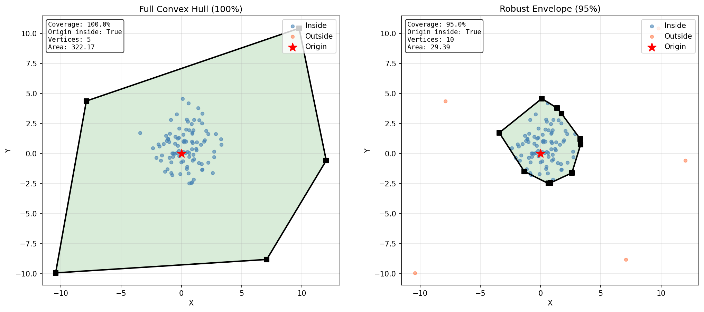
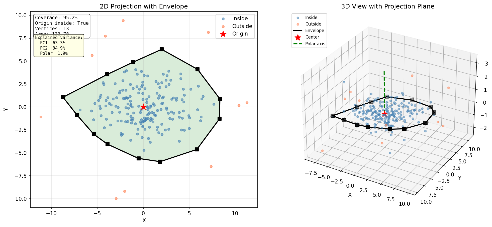

# Convex Envelope Fitting with Outlier Rejection

A Python library for computing convex envelopes around point cloud data in 2D and 3D.

## Problem Statement

Given a set of points (in 2D or 3D), compute a convex envelope that:

1. **Contains the origin** 
2. **Contains approximately a target fraction of data points** (default 95%) - avoiding envelope inflation from outliers

The standard convex hull includes all points, which makes it highly sensitive to outliers. A single extreme point can dramatically increase the hull's area. This project solves that problem by computing a *robust* envelope that captures the main distribution while ignoring outliers.

## Solution Approach

### 2D Convex Envelope (`convex_envelope.py`)

1. **Outlier Detection**: Uses the Minimum Covariance Determinant (MCD) estimator to compute robust Mahalanobis distances for each point
2. **Point Selection**: Keeps only the points with the smallest Mahalanobis distances (based on the coverage parameter)
3. **Hull Computation**: Computes the convex hull of the selected inliers plus the origin

### 3D Projected Envelope (`projected_envelope.py`)

For 3D data, the approach is:

1. **PCA Projection**: Projects 3D points onto the 2D plane of maximum variance using Principal Component Analysis
2. **2D Envelope**: Applies the robust 2D envelope algorithm on the projected points
3. **3D Lifting**: Lifts the 2D envelope vertices back to 3D (on the projection plane)

This captures the main "spread" of the data while ignoring the direction of minimum variance (the polar axis).

## Dependencies

| Package | Purpose |
|---------|---------|
| `numpy` | Array operations and linear algebra |
| `scipy` | ConvexHull computation |
| `scikit-learn` | MinCovDet for robust covariance estimation, PCA for dimensionality reduction |
| `matplotlib` | Visualization |
| `pytest` | Testing |

## Installation

```bash
pip install -r requirements.txt
```

## Usage
Simply run the visualizations by running the test_demos.py file

## Output Examples

### 2D Envelope Comparison

The left plot shows the standard convex hull including all points (heavily influenced by outliers). The right plot shows the robust 95% envelope that tightly fits the main cluster.



### 3D Projected Envelope

The left plot shows the 2D projection with the envelope. The right plot shows the original 3D points with the envelope polygon on the projection plane.


